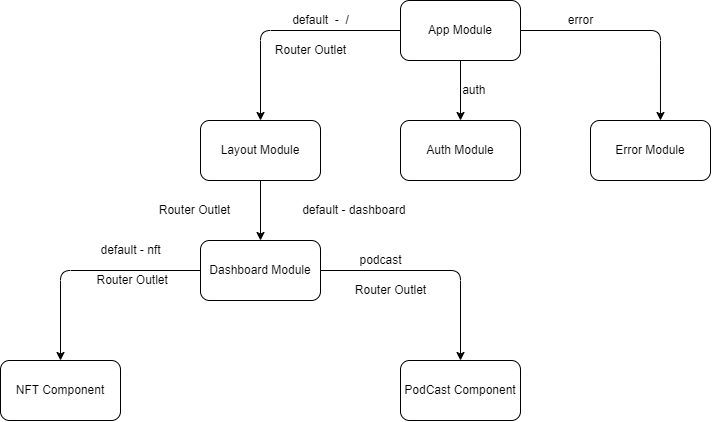

<p align="center">

</p>

# ArtStream

Welcome to **ArtStream** – a dynamic platform where artists and photographers can post and sell their work. Discover and follow talented creators, view popular and recommended artists, and shop unique pieces all in one place.

## Features

- **Newsfeed:** Stay updated with the latest posts from your favorite artists and photographers.
- **Shop:** Browse and purchase unique pieces of art and photography directly from the creators.
- **Wallet:** Manage your transactions and keep track of your purchases.
- **Popular and Recommended Lists:** Easily find popular and recommended artists and photographers to follow.

## Project Design



## Getting Started

Follow these instructions to get a copy of the project up and running on your local machine for development and testing purposes.

### Prerequisites

- Node.js and npm installed on your machine
- Angular CLI installed globally (`npm install -g @angular/cli`)
- Firebase project set up with authentication enabled

### Installation

1. **Clone the repository**:

   ```bash
   https://github.com/nyein2001-dev/ArtStream.git
   cd ArtStream
   ```

2. **Install dependencies**:

   ```bash
   npm install
   ```

3. **Firebase configuration**:

   Before running the application, you need to add your Firebase configuration to `src/environments/environment.ts`. Replace `YOUR_API_KEY`, `YOUR_AUTH_DOMAIN`, `YOUR_PROJECT_ID`,
   `YOUR_STORAGE_BUCKET`, `YOUR_MESSAGING_SENDER_ID`, and `YOUR_APP_ID` with your Firebase project credentials.

   ```typescript
   export const environment = {
     production: false,
     firebase: {
       apiKey: "YOUR_API_KEY",
       authDomain: "YOUR_AUTH_DOMAIN",
       projectId: "YOUR_PROJECT_ID",
       storageBucket: "YOUR_STORAGE_BUCKET",
       messagingSenderId: "YOUR_MESSAGING_SENDER_ID",
       appId: "YOUR_APP_ID",
     },
   };
   ```

4. **Start the development server**:

   ```bash
      ng serve
   ```

## Usage

- **Login/Signup**: Use the authentication forms to register a new user or log in with an existing account.
- **Dashboard**: Once logged in, you can access the shopping dashboard to manage your shopping activities.

## Repo Activities


## Contributing

Feel free to submit issues, pull requests, or feature requests. We welcome all contributions to improve **ArtStream**.

---

Thank you for visiting **ArtStream**! Enjoy discovering and sharing amazing art.
